# Casino - Casino Game Simulator

A console-based casino game simulator written in C++, featuring three classic casino games with a colorful text interface.

## Description

**Casino** is a casino game simulator written in C++, offering three classic games:
- **Blackjack** - classic card game with split, double down, and surrender options
- **Roulette** - roulette wheel with various bet types
- **Slots** - slot machine with different symbols and payouts

The project was created in **CLion** using **CMake** and **C++20** standard.

## Showcase

### Menus
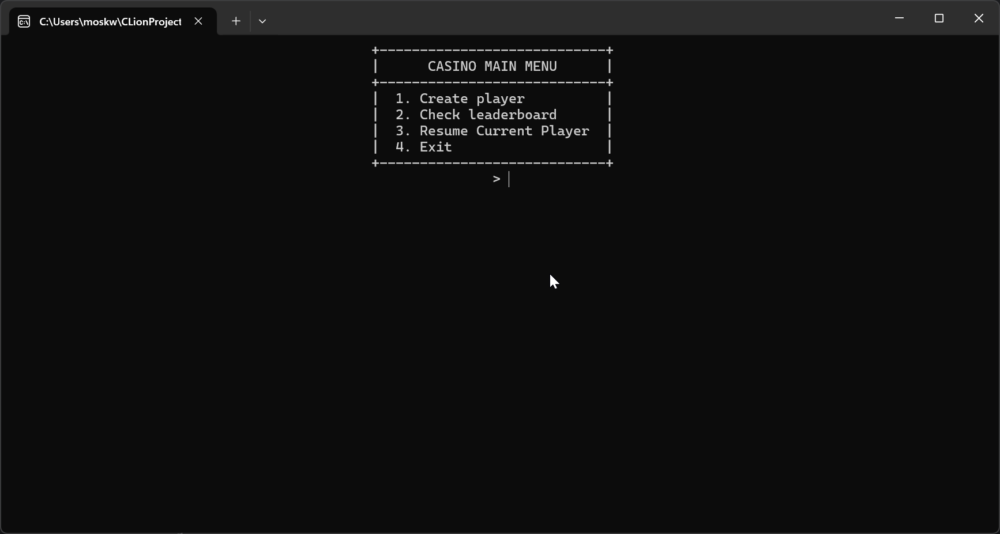
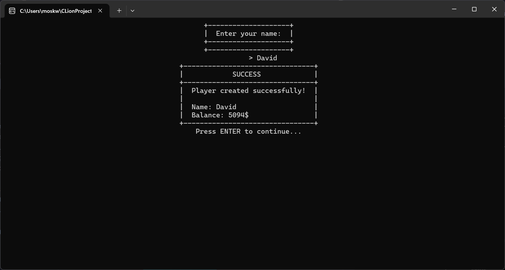
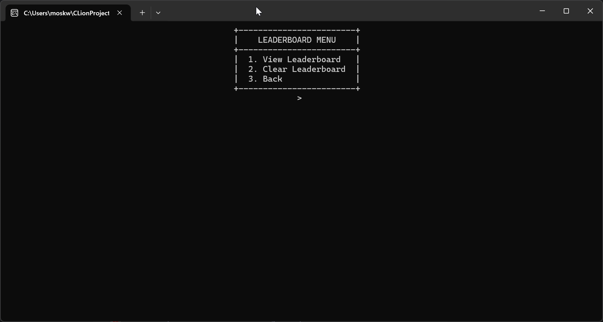
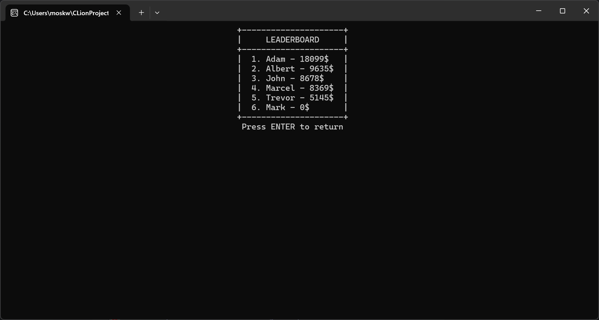
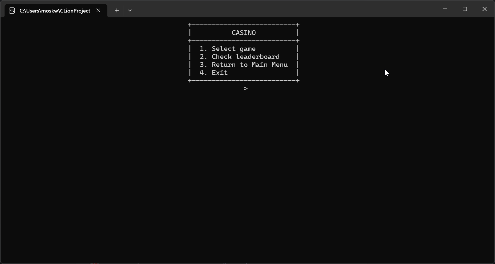
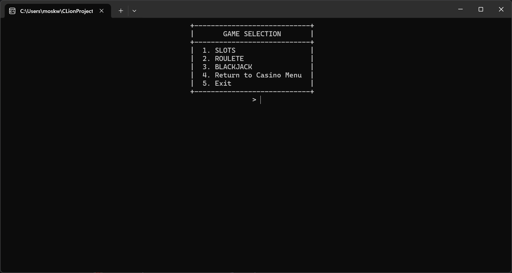

### Blackjack Gameplay
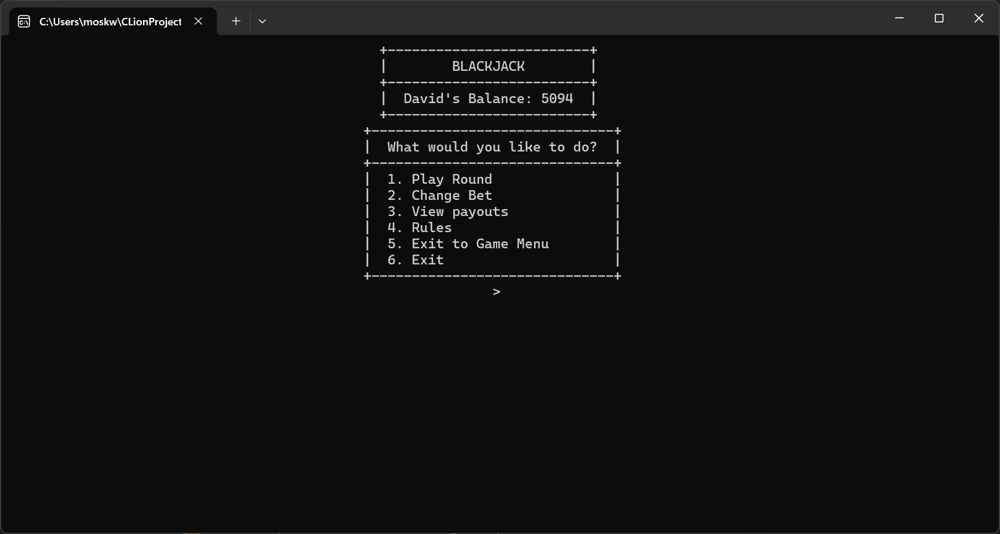
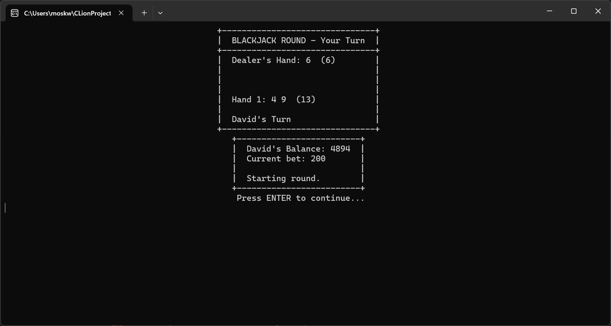


### Roulette Wheel
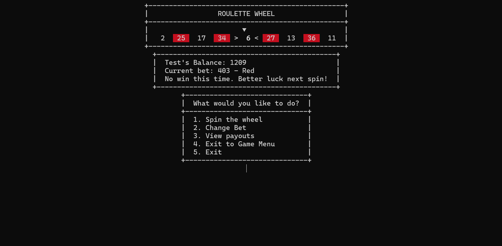
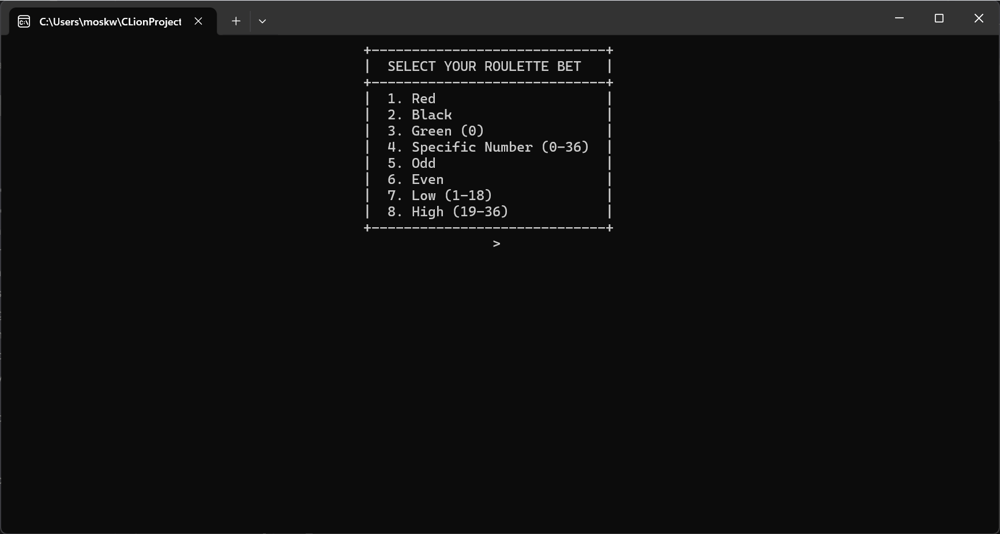

### Slots Machine
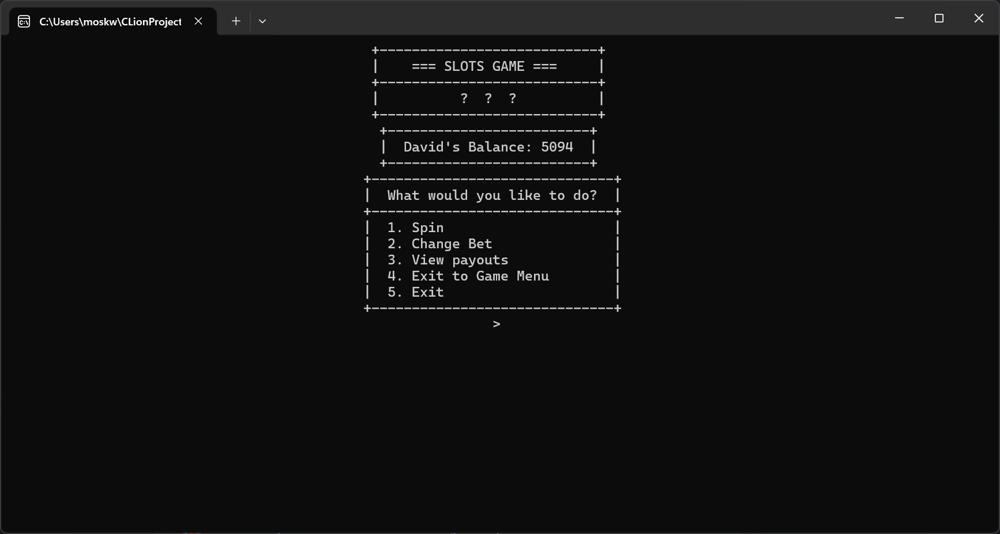
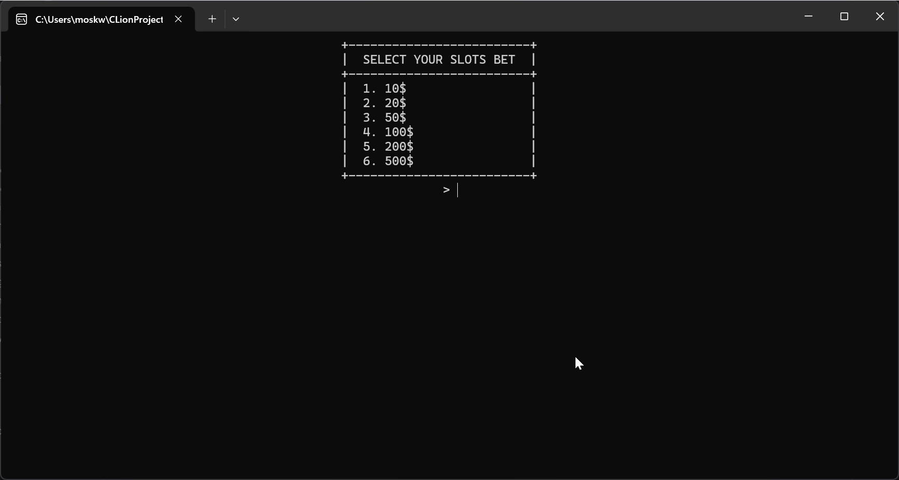

## Features

### Main Features
- ✅ Player system with balance and statistics
- ✅ Three fully functional casino games
- ✅ Score saving system (leaderboard)
- ✅ Intuitive text interface with ANSI colors
- ✅ Pseudo-random number generator (RNG)
- ✅ Animations during gameplay
- ✅ Ability to change bets during the game

### Blackjack
- Full implementation of European Blackjack rules
- Options: Hit, Stand, Double Down, Split, Surrender
- Blackjack detection system (3:2 payout)
- Ability to play multiple hands after split
- Dealer hits to 17

### Roulette
- 37 numbers (0-36)
- Various bet types:
  - Red/Black
  - Green (0)
  - Specific number
  - Even/Odd
  - Low (1-18)/High (19-36)
- Spinning wheel animation

### Slots
- 3 reels with 6 different symbols
- Payouts for pairs and triples
- Symbols: Cherry, Lemon, Bell, Star, Clover, Seven
- Spinning reels animation
- Different payout levels depending on symbols

## System Requirements

- **Operating System**: Windows (requires Windows API for console colors)
- **Compiler**: MinGW-w64 with C++20 support
- **CMake**: version 4.0 or newer
- **IDE**: CLion (recommended) or any environment with CMake support

## Installation and Compilation

### Requirements
```bash
# MinGW with C++20 support
# CMake 4.0+
```

### Compilation
```bash
# In project directory
mkdir build
cd build
cmake ..
cmake --build .
```

### Running
```bash
# In build directory
.\Kasyno.exe
```

## Project Structure

```
Kasyno/
├── main.cpp                 # Application entry point
├── Casino.h/cpp            # Main casino management class
├── Player.h/cpp            # Player class
├── RoundUI.h/cpp           # User interface
├── Rng.h/cpp               # Random number generator
├── FileHandler.h/cpp       # File handling (leaderboard)
├── ExitHelper.h            # Helper functions for exiting
├── CMakeLists.txt          # CMake configuration
├── Games/
│   ├── Game.h              # Abstract base class for games
│   ├── BlackjackGame.h/cpp # Blackjack implementation
│   ├── RouletteGame.h/cpp  # Roulette implementation
│   ├── SlotsGame.h/cpp     # Slots implementation
│   └── RouletteTypes.h     # Types for roulette
└── Resources/
    ├── Enums.h             # State and option enumerations
    └── TextRes.h           # Interface texts
```

## Usage

### Starting the Game
1. Run the application
2. Select "Create Player" from the main menu
3. Enter player name and initial balance
4. Choose a game from the casino menu

### Navigation
- Use numeric keys to select options
- Press ENTER to continue after finishing a round
- You can return to the menu at any time or save your score and exit

### Leaderboard
- Results are automatically saved to `leaderboard.txt` file
- You can check the best scores from the main menu or casino menu
- Ranking is sorted by player balance

## Architecture

### Design Patterns
- **Polymorphism**: All games inherit from the base `Game` class
- **Encapsulation**: Classes manage their internal state
- **Separation of Concerns**: Each class has a clearly defined responsibility

### Key Classes

#### Casino
Main application controller. Manages game state and switching between menus.

#### Player
Represents a player with their balance, bets, and winning statistics.

#### Game (abstract)
Base class for all games. Defines the interface:
- `playRound()` - main game loop
- `askForBet()` - ask for bet
- `renderInterface()` - render interface
- `displayPayouts()` - display payout table

#### RoundUI
Responsible for all user interaction:
- Drawing frames and boxes
- Text coloring
- Getting input
- Animations

#### Rng
Pseudo-random number generator based on `std::mt19937_64`.

#### FileHandler
Handles file operations:
- Save/read leaderboard
- Check player existence

## Technical Details

### Encoding
The application uses **UTF-8** for proper display of special characters.

### ANSI Colors
The interface uses ANSI escape codes for text coloring in Windows console (requires Virtual Terminal Processing enabled).

### Random Number Generator
Uses `std::mt19937_64` with seed from `std::random_device` for high-quality randomness.

## Author

- **[Marczelloo](https://github.com/Marczelloo)** - Creator and main developer

## License

- **[MIT License](LICENSE)**

Copyright (c) 2025 Marczelloo

**Last updated**: December 11, 2025
